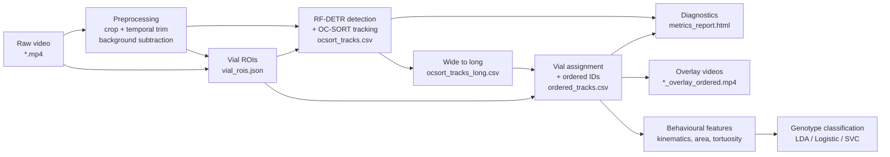

# Drosophila Climbing Behaviour: Fly Tracking and Genotype Classification

End-to-end pipeline for the EPFL fly-climbing assay: raw video in, per-fly
trajectories and genotype predictions out.


## Pipeline at a glance



Every step except detection and classification runs locally with no GPU.
Detection calls Roboflow's hosted RF-DETR over HTTP; classification is pure
scikit-learn.


## Quick start

```bash
git clone <your-repo-url>
cd superfly

# Conda (recommended):
conda env create -f environment.yml
conda activate fly-tracking

# Or pip:
# pip install -r requirements.txt

# Add a Roboflow API key for detection:
cp creds_config.example.yaml creds_config.yaml   # then paste the key into creds_config.yaml
```

`creds_config.example.yaml` is the template; the real `creds_config.yaml` is
gitignored.


## Running the pipeline

A run is defined entirely in **`config.yaml`**: the video to track, the tracker
settings, and which stages run. The workflow is always the same — **edit
`config.yaml`, then launch it.** The notebook and scripts only read
`config.yaml`; you never edit them to change a run.

### Step 1 — configure the run in `config.yaml`

Sections are grouped **Meta** (inputs & environment), **Pipeline** (stages in
execution order), and **Downstream analysis**:

| Section | What it controls |
|---|---|
| `video` | `raw_path` (the clip to track) + `fallback_fps` when metadata is missing |
| `roboflow` | `model_id` and `inference_api_url` for RF-DETR detection |
| `calibration` | `px_per_cm` + output units (cm/px, s/frame) for behavioural features |
| `preprocessing` | `enabled` + background subtraction (percentile, gain, white level, codec) |
| `roi` | Whether to reuse saved vial/crop ROIs or always reopen the GUI |
| `tracker` | RF-DETR confidence, every OC-SORT knob (jump round, behavioral weights), `cached_detections`, and `ghost_detection` |
| `watershed` | Splitting detection boxes that contain two touching flies |
| `pipeline` | `expected_per_vial` — flies per vial, for diagnostics + ghost gating |
| `visualization` | Overlay rendering style + `overlay_source` substrate selection |
| `features` | Optional kinematic feature families |
| `latent_space` | PCA / t-SNE / UMAP embedding settings |
| `classification` | Active classifier (`method`) + per-backend hyperparameters |

### Step 2 — launch it

Notebook (interactive, best for exploring one video):

```bash
jupyter lab notebooks/01_tracking_pipeline.ipynb   # run cells top to bottom
```

Single video (CLI):

```bash
python scripts/run_tracking.py                              # uses video.raw_path
python scripts/run_tracking.py --video data/raw/my_clip.mp4 # override for one run
```

Batch — track every video under a folder, then analyse:

```bash
python scripts/run_all.py --data-root data/raw

# Hands-off: click through every video's crop + ROIs up front, then walk away
# while detection + tracking run unattended (needs roi.use_saved_roi: true).
python scripts/run_all.py --data-root data/raw --draw-first
```

Classification only, from an existing tracked run:

```bash
python scripts/run_classification.py --tracks data/outputs/run_5/ordered_tracks.csv
```

Every entry point writes into `data/outputs/run_<N>_<short_name>/`. Pass
`--help` for the full flag list.


## Outputs

Each tracking run produces:

```
data/outputs/run_<N>_<short_name>/
├── <video_name>.mp4                          # hardlink/copy of the raw input
├── crop_roi.json                             # crop window + temporal trim (if preprocessed)
├── vial_rois.json                            # per-vial bounding boxes
├── detections_raw.csv                        # raw RF-DETR detections (detection cache)
├── ocsort_tracks.csv                         # tracker output (wide format)
├── ocsort_tracks_long.csv                    # long format, one row per (frame, id)
├── ordered_tracks.csv                        # vial-assigned, left-to-right ordered_id
├── tracker_log.json                          # detection, suppression + ghost/exit log
├── run_params.json                           # full param snapshot per stage
├── metrics_report.{md,html}                  # diagnostics report
├── <video_stem>_detections_RF-DETR.mp4       # raw-detection overlay
├── overlay_raw_ocsort.mp4                     # raw OC-SORT track overlay
└── overlay_ordered.mp4                        # ordered-id overlay
```

`run_all.py` runs in fast mode and skips the three overlay videos. `data/outputs/`
and `data/annotations/` are gitignored. Only `.gitkeep` stubs are tracked.


## Repository layout

```
superfly/
├── config.yaml                # the one file you edit to define a run
├── creds_config.example.yaml  # Roboflow key template; copy to creds_config.yaml
├── environment.yml            # conda env spec
├── requirements.txt           # pip mirror
├── utils.py                   # shared helpers (config loading, run outputs)
├── roi_library.json           # cached crop + vial ROIs keyed by video stem
├── RF-DETR_model/             # trained fly-detection model
│   └── weights.pt
├── external/                  # vendored TrackEval — HOTA / MOT scoring
├── data/                      # raw/ input videos + outputs/ tracked runs
├── notebooks/
│   ├── 01_tracking_pipeline.ipynb
│   └── 02_classification_analysis.ipynb
├── scripts/
│   ├── run_tracking.py        # single video, full render
│   ├── run_all.py             # batch tracking (+ --draw-first) then analysis
│   ├── run_classification.py  # genotype classification on ordered_tracks
│   ├── populate_roi_library.py
│   └── export_to_roboflow.py  # dataset export for model training
├── src/
│   │   # -- tracking pipeline --
│   ├── preprocessing.py       # background subtraction + crop/trim GUI
│   ├── roi.py                 # vial ROI drawing + assign_vials_and_ordered_ids
│   ├── tracking.py            # RF-DETR + OC-SORT orchestration
│   ├── watershed_split.py     # split boxes holding two touching flies
│   ├── wide_long.py           # wide -> long format conversion
│   ├── visualization.py       # overlay video rendering
│   ├── metrics.py             # run_diagnostics, per-vial counts, HOTA
│   │   # -- vendored tracker (OC-SORT, lightly modified) --
│   ├── ocsort.py              # OC-SORT implementation
│   ├── kalmanfilter.py        # Kalman filter used per track
│   ├── association.py         # IoU variants + Hungarian matching
│   │   # -- downstream behavioural analysis --
│   ├── features.py            # kinematics, area, tortuosity
│   ├── statistics.py          # Kruskal-Wallis + Cliff's delta significance
│   ├── classification.py      # LDA / Logistic / SVC + plots
│   ├── latent_space.py        # PCA / t-SNE / UMAP embeddings
│   ├── forecasting.py         # next-step movement MLP (genotype-conditioned)
│   ├── plot_colors.py         # stable per-genotype Plotly colours
│   └── ui_context.py          # PyQt GUI helpers
├── parameter_tuning/          # ground-truth, grid search + HOTA scoring
├── labeler/                   # standalone detection-labelling GUI
├── tests/                     # hermetic unit tests (pytest)
└── legacy/                    # deprecated post-hoc stitching (not used)
```


## Verifying the setup

```bash
pytest tests/ -v
```

The tests need no Roboflow key, no videos, and no GPU, so a green run confirms
the environment is installed correctly.


## Acknowledgements

- RF-DETR: [Roboflow](https://roboflow.com)
- OC-SORT: [boxmot](https://github.com/mikel-brostrom/boxmot)
- Dataset: EPFL fly-climbing assay (hTDP43 mutant line)
