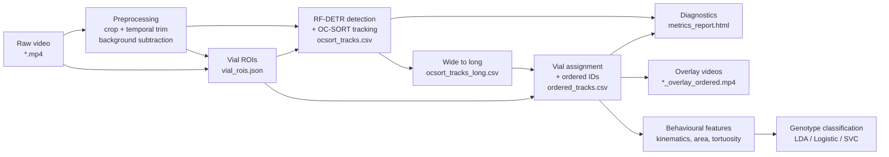

# Drosophila Climbing Behaviour: Fly Tracking and Genotype Classification

End-to-end pipeline for the EPFL fly-climbing assay: raw video in, per-fly
trajectories and genotype predictions out.


## Pipeline at a glance



Every step except detection and classification runs locally with no GPU.
Detection calls Roboflow's hosted RF-DETR over HTTP; classification is pure
scikit-learn.


## Quick start

```bash
git clone <your-repo-url>
cd superfly

# Conda is the supported path; environment.yml pins compatible versions.
conda env create -f environment.yml
conda activate fly-tracking

# Plain pip works too; both files stay in sync manually.
# pip install -r requirements.txt

# Add your Roboflow key (the example file shows the format).
cp creds_config.example.yaml creds_config.yaml
# then edit creds_config.yaml and paste your real API_KEY
```

`creds_config.yaml` is gitignored. `creds_config.example.yaml` is the template.


## Running the pipeline

### Notebook (interactive, recommended for exploration)

```bash
jupyter lab notebooks/01_tracking_pipeline.ipynb
```

Edit `RAW_VIDEO` in cell 3, then run cells top to bottom. Each stage writes
into `outputs/run_<N>_<short_name>/`.

### CLI single-video

```bash
python scripts/run_tracking.py --video data/my_clip.mp4
```

### CLI batch (one experiment folder of subdirs, each with one `*-converted.mp4`)

```bash
python scripts/run_batch_tracking_pipeline.py \
    --dpe-root "2024-02-05_NEG-008_.../24 DPE"
```

### Classification

```bash
python scripts/run_classification.py --tracks outputs/run_5/ordered_tracks.csv
```

All three CLIs respect `config.yaml` defaults. Pass `--help` for the full flag list.


## Outputs

Each tracking run produces:

```
outputs/run_<N>_<short_name>/
├── <video_name>.mp4                          # hardlink/copy of the raw input
├── crop_roi.json                             # crop window + temporal trim
├── vial_rois.json                            # per-vial bounding boxes
├── detections_raw.csv                        # raw RF-DETR detections
├── ocsort_tracks.csv                         # tracker output (wide format)
├── ocsort_tracks_long.csv                    # long format, one row per (frame, id)
├── tracks_relinked.csv                       # post-OC-SORT re-link swaps
├── ordered_tracks.csv                        # vial-assigned, left-to-right ordered_id
├── tracker_log.json                          # detection + suppression log
├── run_params.json                           # full param snapshot per stage
├── metrics_report.{md,html}                  # diagnostics report
├── <short_name>_detections_RF-DETR.mp4
├── <short_name>_overlay_raw_ocsort.mp4
└── <short_name>_overlay_ordered.mp4
```

`outputs/` and `data/annotations/` are gitignored. Only `.gitkeep` stubs are tracked.


## Repository layout

```
superfly/
├── config.yaml                # tunable defaults for the active pipeline
├── creds_config.example.yaml  # template; copy to creds_config.yaml
├── environment.yml            # conda env spec
├── requirements.txt           # pip mirror
├── utils.py                   # shared helpers (save_run_params, video resolution)
├── assets/
│   └── preprocessing_style.qss  # Qt stylesheet for the preprocessing GUI
├── notebooks/
│   ├── 01_tracking_pipeline.ipynb
│   └── 02_classification_analysis.ipynb
├── scripts/
│   ├── run_tracking.py
│   ├── run_batch_tracking_pipeline.py
│   ├── run_classification.py
│   ├── grid_search_tracker_params.py
│   ├── populate_roi_library.py
│   ├── merge_labeler_sessions.py
│   └── export_to_roboflow.py
├── src/
│   ├── __init__.py            # public API surface
│   ├── preprocessing.py       # background subtraction + crop/trim GUI
│   ├── tracking.py            # RF-DETR + OC-SORT
│   ├── ocsort.py              # OC-SORT implementation
│   ├── kalmanfilter.py
│   ├── association.py
│   ├── wide_long.py           # wide -> long format conversion
│   ├── stitching.py           # compatibility shim only (re-exports wide_to_long)
│   ├── roi.py                 # vial ROI drawing + assign_vials_and_ordered_ids
│   ├── metrics.py             # run_diagnostics, per-vial counts, swap analysis
│   ├── features.py            # kinematics, area, tortuosity
│   ├── classification.py      # LDA / Logistic / SVC + plots
│   ├── latent_space.py        # PCA / UMAP / autoencoder
│   ├── visualization.py       # overlay video rendering
│   └── ui_context.py
├── tests/
│   ├── conftest.py
│   ├── test_imports.py
│   ├── test_config_schema.py
│   ├── test_wide_long.py
│   ├── test_roi_ordering.py
│   ├── test_utils.py
│   └── test_legacy_compat.py
├── legacy/                    # post-hoc tracklet stitching (deprecated)
│   ├── stitching.py           # 50+ KB of Hungarian linking code
│   ├── stitching_config.yaml  # parameters for the deprecated stitcher
│   ├── run_stitching.py       # SystemExit stub for safety
│   └── grid_search_stitching_params.py
├── parameter_tuning/          # offline ground-truth + tuning experiments
└── roi_library/               # cached crop + vial ROIs keyed by video stem
```


## Configuration

Active pipeline parameters live in `config.yaml`:

| Section | What it controls |
|---|---|
| `roboflow` | `model_id` (default), `inference_api_url` |
| `video` | `fallback_fps` when video metadata is missing |
| `tracker` | RF-DETR confidence + every OC-SORT knob (jump round, behavioral weights) |
| `pipeline` | `expected_per_vial` for diagnostics (number of flies per vial) |
| `relink` | Round-2 re-linking thresholds |
| `preprocessing` | Background subtraction (percentile, gain, white level) |
| `visualization` | Overlay rendering style + substrate selection |
| `roi` | Whether to reuse saved vial/crop ROIs or always reopen the GUI |
| `latent_space` | PCA / UMAP / autoencoder for classification |

Deprecated post-hoc stitching parameters live in
`legacy/stitching_config.yaml`. The active pipeline does not read that file.


## Public API

```python
from src import (
    preprocess_bgsub_gui,                # GUI: crop + temporal trim + bg subtract
    export_tracks_xy_tuple_csv_one_config,  # RF-DETR + OC-SORT
    wide_to_long,                        # tracker output to long format
    draw_and_save_vial_rois,             # GUI: draw per-vial bounding boxes
    assign_vials_and_ordered_ids,        # vial assignment + left-to-right IDs
    extract_behavioral_features,         # kinematics, area, tortuosity
    aggregate_per_fly_features,          # collapse to one row per fly
    run_classifier,                      # LDA / Logistic / SVC + cross-val
    render_vial_overlay_video,           # overlay video with vial colours
)
```


## Development

### Run the test suite

```bash
pytest tests/ -v
```

The tests are hermetic: no Roboflow API, no real videos, no GPU. They cover
the public import surface, the `config.yaml` schema contract, the
wide-to-long round trip, vial-assignment ordering invariants, the
`save_run_params` merging behaviour, and the `src.stitching` deprecation shim.

### Strip notebook outputs from commits

Run `nbstripout` once to register a git filter that removes cell outputs from
every committed notebook:

```bash
pip install nbstripout
nbstripout --install
```

This keeps notebook diffs reviewable and prevents 100 KB of binary plot data
from creeping into commits.

### Repo conventions

- `legacy/` holds code that is no longer part of the active pipeline. Do not
  add new dependencies on it.
- `assets/` holds non-Python files used by `src/` modules.
- Any new public function in `src/<module>.py` should be re-exported from
  `src/__init__.py` and added to `tests/test_imports.py`.
- Any new top-level section or required key in `config.yaml` should be added
  to `tests/test_config_schema.py`.


## Acknowledgements

- RF-DETR: [Roboflow](https://roboflow.com)
- OC-SORT: [boxmot](https://github.com/mikel-brostrom/boxmot)
- Dataset: EPFL fly-climbing assay (hTDP43 mutant line)
