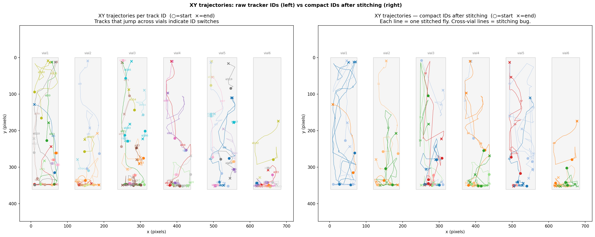
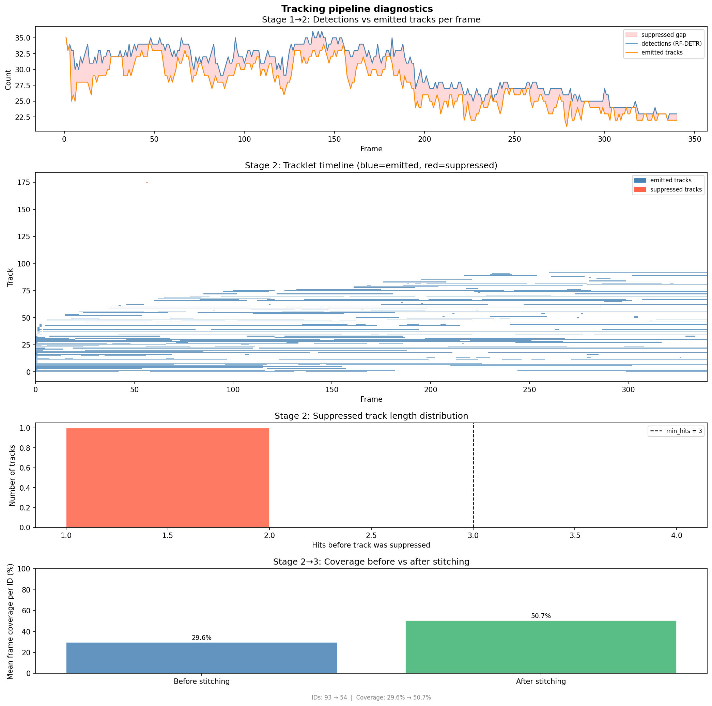

# Metrics Report

## Configuration

```json
{
  "tracker": {
    "confidence": 0.03,
    "track_activation_threshold": 0.1,
    "lost_track_buffer": 180,
    "minimum_matching_threshold": 0.2,
    "minimum_consecutive_frames": 3,
    "min_area": 40,
    "asso_func": "diou",
    "brownian_pos_noise": 15
  },
  "stitching": {
    "stitching_mode": "per_vial",
    "vial_count_cap": 7,
    "general_count_cap": 56,
    "fps": 30,
    "pause_threshold": 1.0,
    "edge_fraction": 0.1,
    "min_points_for_scale": 10,
    "expected_per_vial": 7,
    "short_track_frac": 0.1,
    "link_score_weights": {
      "extrap": 0,
      "direction": 0,
      "behavioral": 0
    },
    "direction_weights": {
      "heading_vs_gap": 0.5,
      "overall_vs_overall": 0.5
    },
    "behavioral_weights": {
      "median_velocity": 1.0,
      "pause_fraction": 1.0,
      "mean_turning_angle": 1.0,
      "mean_angular_velocity": 1.0,
      "mean_acceleration": 1.0,
      "n_large_displacements": 1.0,
      "tortuosity": 1.0
    }
  },
  "preprocessing": {
    "bg_gain": 1.2,
    "bg_white_level": 245,
    "bg_percentile": 85.0,
    "bg_sample_stride": 1,
    "default_end": 700,
    "codec": "mp4v"
  },
  "visualization": {
    "fps_out": 30,
    "radius": 5,
    "show_ids": true
  },
  "roi": {
    "snap_threshold_pct": 0.01,
    "snap_enabled": true
  }
}
```

## Summary

```
=======================================================
  TRACKER DIAGNOSTICS
=======================================================
  Frames processed        : 340
  Mean detections / frame : 29.77
  Mean emitted / frame    : 27.54
  Unique IDs in CSV       : 93
  Fragmentation ratio     : 2.2x  (93 ids / 42 expected)
  Mean ID coverage        : 29.6% of frames
  Suppressed tracks       : 83  (died before min_hits=3)
  Mean hits (suppressed)  : 0.01
  Near threshold (>=70%)  : 0.0% of suppressed

  Interpretation:
    ⚠ Detector is missing flies frequently → check preprocessing or lower confidence threshold
    ⚠ Low mean coverage per ID → tracks are very short and broken → check Q matrix (Brownian noise) or IoU threshold
=======================================================
```

## Stitching Duplicate Check

**0 duplicate (frame, stitched_id) pairs — clean.**

## Stitching Quality Objectives

| Objective | Value |
|---|---|
| vial_count_error | 14.0 |
| per_id_coverage_loss | 166.6 frames/fly |
| short_track_count | 2 |
| per_frame_id_variance | 6.272 |

## XY Trajectories



## Pipeline Diagnostics


