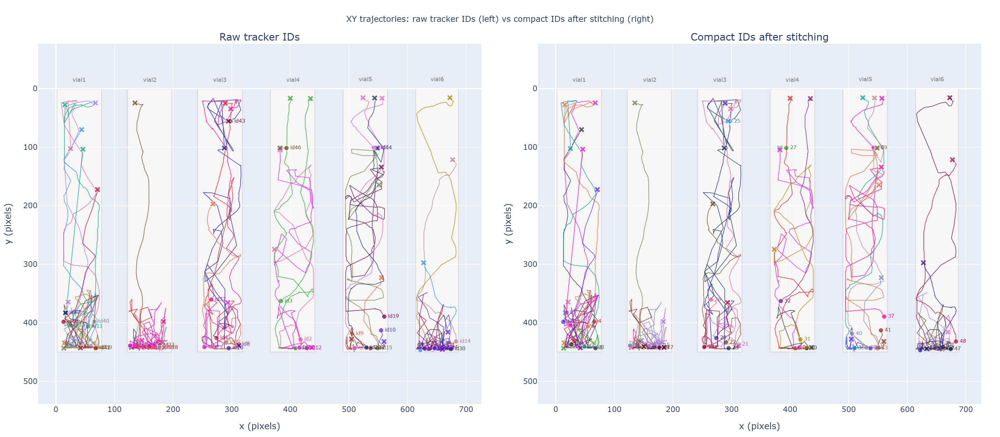
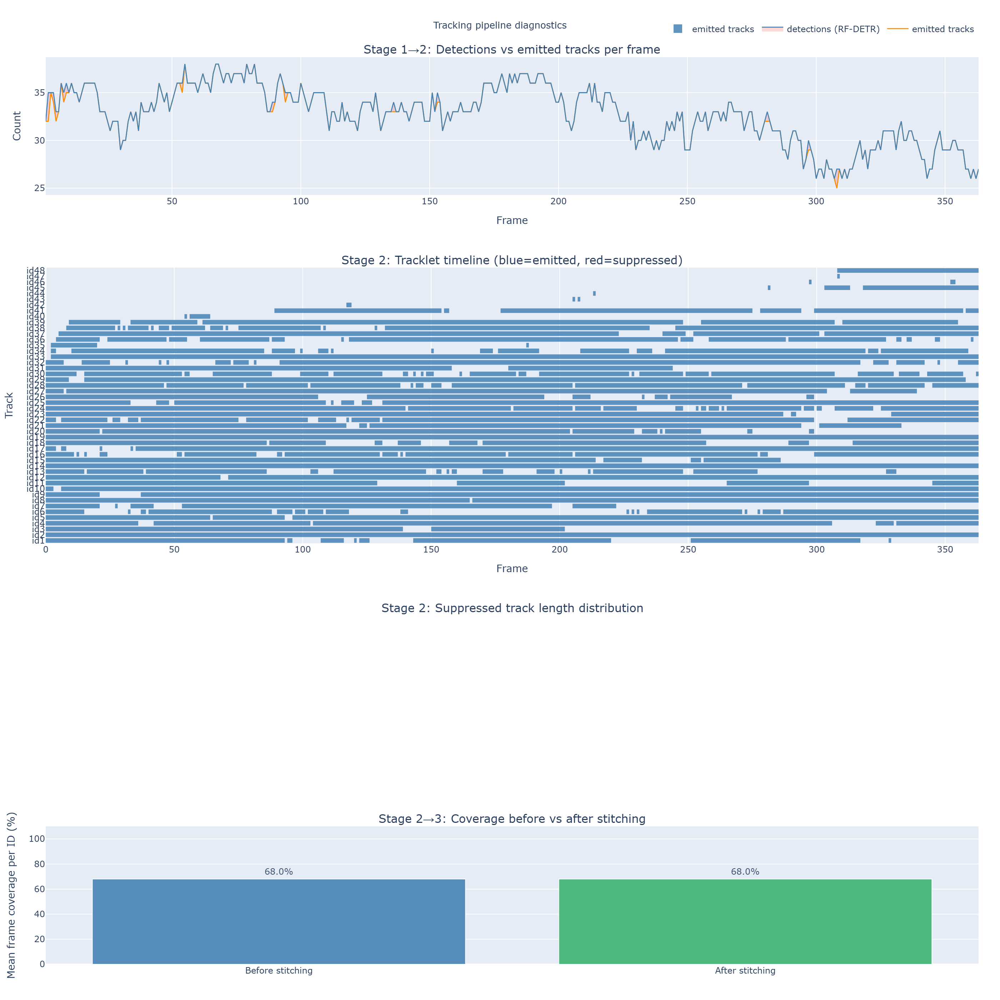

# Metrics Report

> Interactive version: [metrics_report.html](metrics_report.html)

## Configuration

```json
{
  "roboflow": {
    "model_id": "flies-123/2"
  },
  "tracker": {
    "detection_confidence_rfdetr": 0.4,
    "confidence": 0.55,
    "track_activation_threshold": 0.1,
    "lost_track_buffer": 180,
    "minimum_matching_threshold": 0.2,
    "minimum_consecutive_frames": 1,
    "min_area": 20,
    "asso_func": "diou",
    "brownian_pos_noise": 15,
    "aspect_weight": 0.05,
    "behavioral_weight": 0.05,
    "jump_factor": 2.0,
    "jump_iou_threshold": 0.05,
    "jump_inertia": 0.05,
    "overlap_iou_scale": 0.1,
    "edge_fraction": 0.1
  },
  "stitching": {
    "stitching_mode": "per_vial",
    "stop_mode": "converge",
    "max_rounds": 10,
    "w_under": 15,
    "w_over": 2.0,
    "vial_count_cap": 7,
    "general_count_cap": 56,
    "fps": 30,
    "pause_threshold": 1.0,
    "edge_fraction": 0.1,
    "min_points_for_scale": 10,
    "expected_per_vial": 7,
    "short_track_frac": 0.1,
    "link_score_weights": {
      "extrap": 0.4,
      "direction": 0.3,
      "behavioral": 0.3
    },
    "direction_weights": {
      "heading_vs_gap": 0.7,
      "overall_vs_overall": 0.3
    },
    "behavioral_weights": {
      "median_velocity": 1.0,
      "pause_fraction": 1.0,
      "mean_turning_angle": 1.0,
      "mean_angular_velocity": 1.0,
      "mean_acceleration": 1.0,
      "n_large_displacements": 1.0,
      "tortuosity": 1.0
    }
  },
  "preprocessing": {
    "bg_gain": 1.2,
    "bg_white_level": 245,
    "bg_percentile": 85.0,
    "bg_sample_stride": 1,
    "codec": "mp4v"
  },
  "visualization": {
    "overlay_source": "raw_cropped",
    "fps_out": 30,
    "show_ids": true,
    "tick_len": 2,
    "tick_thick": 0.3,
    "chip_font_scale": 0.32,
    "label_offset_x": 10,
    "label_offset_y": -10,
    "chip_pad": 1,
    "leader_thick": 1,
    "show_unmatched_detections": true,
    "unmatched_tolerance_k": 2.0
  },
  "roi": {
    "use_saved_roi": true,
    "snap_threshold_pct": 0.005,
    "snap_enabled": true
  }
}
```

## Summary

```
=======================================================
  TRACKER DIAGNOSTICS
=======================================================
  Frames processed        : 363
  Mean detections / frame : 32.68
  Mean emitted / frame    : 32.64
  Unique IDs in CSV       : 48
  Fragmentation ratio     : 1.1x  (48 ids / 42 expected)
  Mean ID coverage        : 68.0% of frames
  Suppressed tracks       : 0  (died before min_hits=1)
  Mean hits (suppressed)  : 0.0
  Near threshold (>=70%)  : 0.0% of suppressed

  Interpretation:
    ⚠ Detector is missing flies frequently → check preprocessing or lower confidence threshold
=======================================================
```

## Stitching Duplicate Check

**0 duplicate (frame, stitched_id) pairs — clean.**

## Stitching Quality Objectives

| Objective | Value |
|---|---|
| vial_count_error | 8.0 |
| per_id_coverage_loss | 116.2 frames/fly |
| short_track_count | 7 |
| per_frame_id_variance | 4.837 |

## XY Trajectories



## Pipeline Diagnostics


